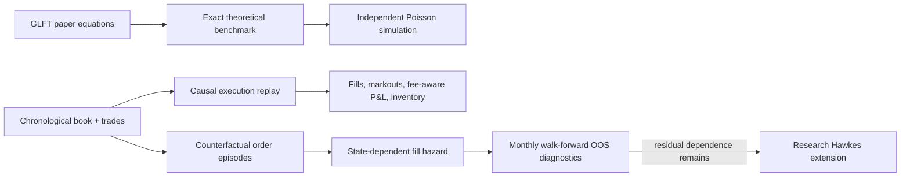

# GLFT Market Making Lab

[](https://github.com/333Rosky/glft-market-making-lab/actions/workflows/ci.yml)

A research-only implementation of the Guéant–Lehalle–Fernandez-Tapia (GLFT)
market-making model, with the paper benchmark kept strictly separate from empirical
execution and fill modeling.

This repository is not a generic strategy library and is not a live trading bot. Its first
job is to reproduce the GLFT equations faithfully and test them. Its second job is to ask,
with causal market-data replay, which assumptions survive contact with an order book.

## Why Poisson is still here

The GLFT paper assumes independent fills with

$$
\lambda(\delta)=A e^{-k\delta}.
$$

That assumption remains untouched in the **theoretical benchmark** because changing it
would stop being a paper replication. It is not treated as a realistic HFT execution
model.

For empirical work, the lab instead estimates a side-specific conditional fill hazard:

$$
\lambda_t^{s}(\delta)=\exp f(\text{distance},\text{spread},\text{imbalance},
\text{OFI},\text{volatility},\text{queue ahead},\text{age},\text{time}).
$$

The initial `f` is a regularized log-linear model with exposure offset and train-only
robust scaling. A Hawkes layer is considered only when held-out residual auto- or
cross-correlation remains material. Adverse selection is measured through post-fill
markouts; it is an outcome to model, not a replacement for the fill-arrival process.

As a basic sanity check, a diagnostic run on the verified COIN-M `BTCUSD_PERP`
`aggTrades` archive for 2024-09-01 found 150,876 aggregate-trade rows, a 26 ms median
inter-arrival time, inter-arrival CV 2.43, and a 100 ms Fano factor 18.15 (2.75 for the
median within-minute Fano factor). The underlying file is intentionally not bundled with
the repository. A homogeneous Poisson process would target CV and Fano factor near 1.
These descriptive results are inconsistent with homogeneous trade arrivals; they do not
reject every state-conditional Poisson likelihood for fills.

## Architecture



The three paths are deliberately separate: a theoretical benchmark should not silently
inherit replay mechanics, and an empirical fill model should not be presented as an exact
replication of the paper.

## Exact GLFT implementation

For inventory states $q\in\{-Q,\ldots,Q\}$, the implementation uses

$$
c=\frac{1}{\gamma}\log\left(1+\frac{\gamma}{k}\right),\qquad
\eta=A\left(1+\frac{\gamma}{k}\right)^{-\left(1+k/\gamma\right)},
$$

$$
\alpha=\frac{k\gamma\sigma^2}{2},\qquad \beta=k\mu,
$$

with tridiagonal matrix

$$
M_{q,q}=\alpha q^2-\beta q,\qquad M_{q,q\pm1}=-\eta,
$$

and finite-horizon value vector

$$
v(t)=\exp\{-M(T-t)\}\mathbf{1}.
$$

The optimal distances are

$$
\delta_b^*(t,q)=c+\frac{1}{k}\log\frac{v_q(t)}{v_{q+1}(t)},\qquad
\delta_a^*(t,q)=c+\frac{1}{k}\log\frac{v_q(t)}{v_{q-1}(t)},
$$

with the risk-increasing side disabled at the inventory boundary. Tests pin every one of
these identities and the boundary behavior.

## Install

Python 3.10 or newer is required.

```bash
python -m venv .venv
source .venv/bin/activate
python -m pip install -e ".[dev]"
```

## Quick start

Run the paper benchmark independently of any market replay:

```bash
glft-lab benchmark --seed 7
```

Check whether aggregate-trade arrivals resemble a homogeneous Poisson process:

```bash
glft-lab arrival-diagnostics \
  --trades data/BTCUSD_PERP-aggTrades-2024-09.csv \
  --start 2024-09-01T00:00:00Z \
  --end 2024-09-02T00:00:00Z
```

Run a bounded COIN-M execution smoke with explicit inverse-contract accounting:

```bash
glft-lab replay \
  --book data/BTCUSD_PERP-bookTicker-2024-09.csv \
  --trades data/BTCUSD_PERP-aggTrades-2024-09.csv \
  --start 2024-09-01T00:00:00Z \
  --end 2024-09-01T00:10:00Z \
  --tick-size 0.1 \
  --accounting-model inverse \
  --contract-multiplier 100 \
  --trade-quantity-mode as_is \
  --quantity-step 1 \
  --order-size 1 \
  --inventory-unit 1 \
  --placement-latency-ms 5 \
  --cancel-latency-ms 5 \
  --max-events 100000
```

The default GLFT parameters in that command are illustrative, not calibrated. Use
`glft-lab replay --help` to set parameters and fees explicitly.

Generate monthly hazard episodes, then hold October out from a September fit:

```bash
glft-lab episodes \
  --book data/BTCUSD_PERP-bookTicker-2024-09.csv \
  --trades data/BTCUSD_PERP-aggTrades-2024-09.csv \
  --output artifacts/episodes-2024-09.jsonl \
  --tick-size 0.1 \
  --quantity-step 1

glft-lab episodes \
  --book data/BTCUSD_PERP-bookTicker-2024-10.csv \
  --trades data/BTCUSD_PERP-aggTrades-2024-10.csv \
  --output artifacts/episodes-2024-10.jsonl \
  --tick-size 0.1 \
  --quantity-step 1

glft-lab walk-forward \
  --episodes artifacts/episodes-2024-09.jsonl artifacts/episodes-2024-10.jsonl \
  --train-month 2024-09 \
  --test-month 2024-10
```

## Market data

Large files are intentionally excluded from Git. The streaming readers expect Binance
CSV columns matching:

- `bookTicker`: update id, best bid/ask price and quantity, transaction time;
- `aggTrades`: aggregate trade id, price, quantity, transaction time, buyer-is-maker.

The local convention is:

```text
data/BTCUSD_PERP-bookTicker-2024-09.csv
data/BTCUSD_PERP-aggTrades-2024-09.csv
data/BTCUSD_PERP-bookTicker-2024-10.csv
data/BTCUSD_PERP-aggTrades-2024-10.csv
```

Raw Binance archive tooling and schemas are documented in
[`binance-public-data`](https://github.com/binance/binance-public-data).

Both files in a replay must come from the same archive family. `BTCUSD_PERP` is COIN-M;
a USDⓈ-M `BTCUSDT` trade file is not interchangeable merely because timestamps and prices
look similar. For official `BTCUSD_PERP`, quantities are integer contracts, the contract
multiplier is 100 USD, and inverse P&L and fees settle in BTC. Setting `--quantity-step 1`
makes replay and episode generation fail fast on fractional, mismatched volumes.

The verified Binance monthly `bookTicker` archive for October 2024 itself ends on
2024-10-14 06:04:15 UTC. The short October smoke is valid only inside that observed
segment; a full-calendar-month October test requires a complete L2/diff-depth source.

## Empirical validation protocol

The initial two-month protocol, followed by monthly rolling, is chronological and
leakage-safe:

1. construct exposure intervals from information observable when the order is live;
2. use the interval end as label-availability time;
3. fit feature scaling and hazard coefficients on September only;
4. evaluate October untouched;
5. advance month by month using expanding or fixed rolling training windows;
6. open the Hawkes research gate only from out-of-sample residual diagnostics.

Walk-forward diagnostics cover fill calibration (log likelihood, deviance, Brier score
and calibration bins). Replay results separately provide realized markouts at configured
horizons, fee-aware equity and P&L, inventory and drawdown. When markout, net-P&L and
inventory arrays are explicitly supplied to the metric layer, it also reports aggregate
markout statistics, inventory exposure, drawdown, VaR and expected shortfall; those
series are not inferred automatically by the hazard model.

## Replay assumptions and limitations

- Events are processed chronologically and retain aggressor side and volume.
- Placement and cancellation acknowledgements have independent configurable latency.
- Resting orders support price-time ordering among simulated orders, approximate external
  queue-ahead depletion and partial fills.
- Tick rounding, post-only rejection, signed maker fees (negative rates represent
  rebates), taker fees and optional final liquidation are explicit.
- `bookTicker` is BBO only, so neither empirical path reconstructs the exchange's external
  FIFO queue. In replay, an order joining the displayed touch starts behind displayed
  quantity, an inside-spread improvement starts with zero external queue, and an order
  away from the touch has unknown queue until its price becomes visible. A print strictly
  through its limit is treated as evidence that it filled.
- In the counterfactual episode sampler, touch orders start behind displayed quantity but
  deeper levels start at zero because their depth is unknown. Every such observation is
  explicitly flagged as approximate; this convention is not uniformly conservative.
  Displayed size reductions are never silently counted as fills in either path.
- Binance `bookTicker` and `aggTrades` identifiers are different sequence domains. For
  equal millisecond timestamps, the merge uses trade-before-book as a documented
  no-lookahead rule and assigns a synthetic comparable sequence before replay.
- Exact queue research should use exchange-native L2 snapshots plus diff-depth updates.
- Historical replay cannot recover hidden liquidity, private order acknowledgements, or
  the latency path of a real colocated system.

## Development

```bash
python -m ruff check .
python -m ruff format --check .
python -m pytest -q
```

The maintained source lives under `src/glft_lab/`; old unrelated crypto, FX, options and
notebook artifacts are intentionally not part of this repository.

## References

- Guéant, Lehalle and Fernandez-Tapia,
  [*Dealing with the Inventory Risk: A solution to the market making problem*](https://arxiv.org/abs/1105.3115).
- Huang, Lehalle and Rosenbaum,
  [*Simulating and analyzing order book data: The queue-reactive model*](https://arxiv.org/abs/1312.0563).
- Wu, Rambaldi, Muzy and Bacry,
  [*Queue-reactive Hawkes models for the order flow*](https://arxiv.org/abs/1901.08938).
- Morariu-Patrichi and Pakkanen,
  [*State-dependent Hawkes processes and their application to limit order book modelling*](https://arxiv.org/abs/1809.08060).
